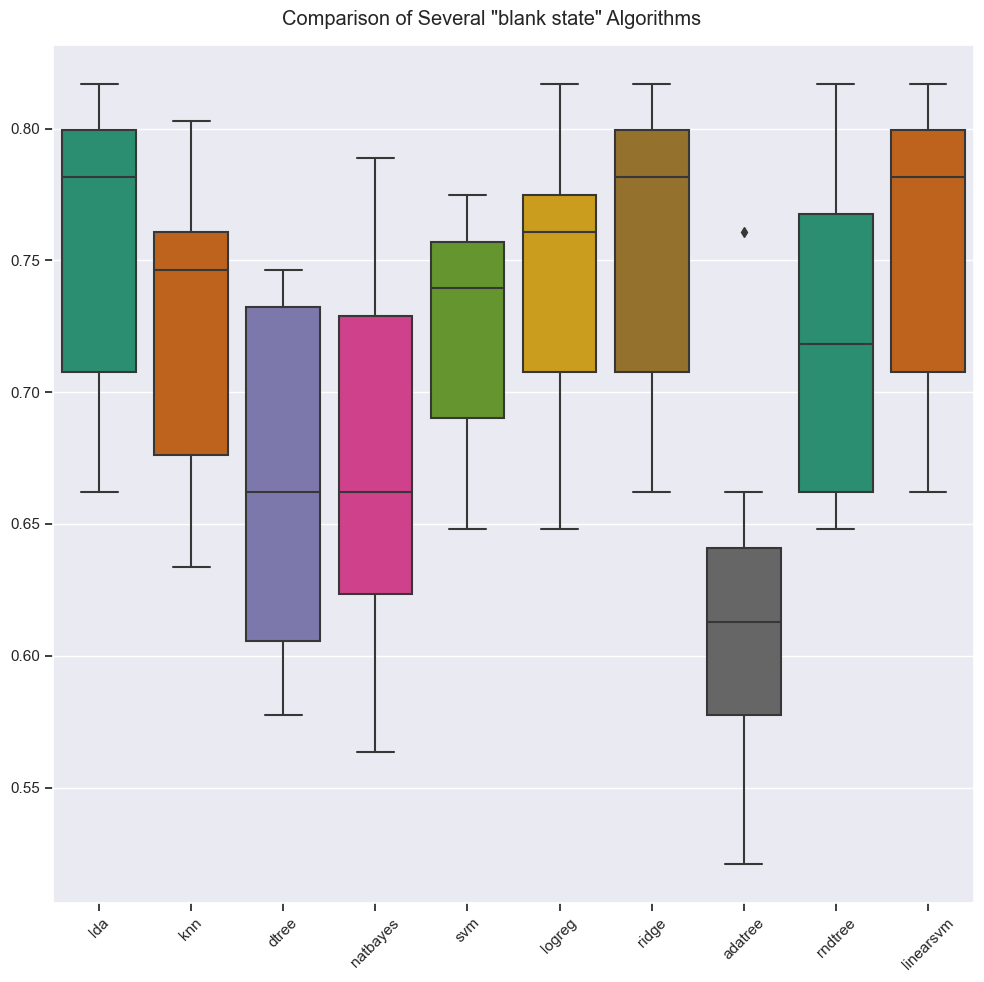
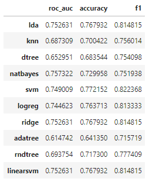

 <!--  -->

    

# DataCamp Professional Certification - Popular Recipes Prediction

 
 

This repository holds a notebook and a presentation used for the Datacamp Professional Data Scientist Certification exam. The goal of the project was, given a dataset sampling data from an online recipe builder / recommendation service, predict which recipes were popular and resulted in higher traffice to the rest of the service's site.  

## Table of Contents

1. [DataCamp Professional Certification - Popular Recipes Prediction](#datacamp-professional-certification---popular-recipes-prediction)
   1. [Table of Contents](#table-of-contents)
   2. [Installation and Setup](#installation-and-setup)
      1. [Codes and Resources Used](#codes-and-resources-used)
      2. [Python Packages Used](#python-packages-used)
   3. [Data](#data)
      1. [Source Data](#source-data)
      2. [Data Preprocessing](#data-preprocessing)
         1. [Data Validation](#data-validation)
         2. [Feature Transformation / Engineering](#feature-transformation--engineering)
   4. [Results and evaluation](#results-and-evaluation)
   5. [Future work](#future-work)
   6. [License](#license)

## Installation and Setup
The analysis is presented as a Jupyter notebook in [notebook.ipynb](notebook.ipynb).

### Codes and Resources Used
- **Python Version:** 3.10

### Python Packages Used

- **General Purpose:** `warnigns, random` .
- **Data Validation:**  `chardet, missgingno` .
- **Data Manipulation:** `pandas, numpy` .
- **Statistical Analysis:** `statsmodels, scipy, pingouin`
- **Data Visualization:** `seaborn, matplotlib` .
- **Machine Learning:** `scikit-learn` .

## Data

### Source Data
The dataset consists of 947 rows with the following columns specified by the business:

 | Column Name  | Type      | Details                                                                                                                                                                                        |
 | ------------ | --------- | ---------------------------------------------------------------------------------------------------------------------------------------------------------------------------------------------- |
 | recipe       | Numeric   | unique identifier of recipe                                                                                                                                                                    |
 | calories     | Numeric   | number of calories                                                                                                                                                                             |
 | carbohydrate | Numeric   | amount of carbohydrates in grams                                                                                                                                                               |
 | sugar        | Numeric   | amount of sugar in grams                                                                                                                                                                       |
 | protein      | Numeric   | amount of protein in grams                                                                                                                                                                     |
 | category     | Character | type of recipe. Recipes are listed in one of ten possible groupings (Lunch/Snacks', 'Beverages',  'Potato', 'Vegetable', 'Meat', 'Chicken,  'Pork',  'Dessert', 'Breakfast', 'One Dish Meal'). |
 | servings     | Numeric   | number of servings for the recipe                                                                                                                                                              |
 | high_traffic | Character | if the traffic to the site was high when this recipewas shown, this is marked with “High”                                                                                                      |

### Data Preprocessing

The data was cleaned per column each column, after splitting in train / test sets to prevent data leakage before training the models.

#### Data Validation

- 'high_traffic' has been converted to boolean assigning "True" to 'High' and "False" to the nulls.  
- 'servings' only contains the numerical {1,2,4,6} values.  
- 'recipe' has been used as index and dropped as variable.  
- Within the 'category' column 'Chicken Breast' has been converted to 'Chicken'.  

#### Feature Transformation / Engineering
  
- Data has been split into a train and test set, with a 25% holdout.  
- Missing values have been imputed using the column medians for each grouping of category/serving, given that for all missing values these two pieces of information were still available.
- Outliers have been identified using the IQR method and transformed using a robust quantile regressor.
- A Box-Cox transformation has been applied to all numerical columns to alleviate the skewness and bring them closer to normally distributed variables.
- A normalization has been applied to fit the numerical columns ranges to [0,1].
- After inspecting the statistical significance of 'servings' as a numerical column, it was concluded that it can be considered a categorical variable and it was one-hot encoded along with the 'category' column.

## Results and evaluation
Being a binary classification project, the models were evaluated on the basis of their **ROC-AUC score**, **accuracy** and **F1 scores**.  
An initial battery of blank models was trained and tested: 

|               Models               |                     Scores                      |
| :--------------------------------: | :---------------------------------------------: |
|  |  |
 

After hyperparameter tuning and comparing models' performances against test sets, the best performing model was a *blank* support vector machine with an ROC-AUC score of **74.9%**, an accuracy of  **77.2%** and an F1 Score of **82.2%**. 

## Future work
- Convert the outlier treatment to an standalone package.
- Explore a better feature selection process.
- Revisit hyperparmeter tuning, having identified importan features and patters, in order to obtain higher scoring models.

## License
This github repository is published under the [MIT License](https://opensource.org/license/mit/).
