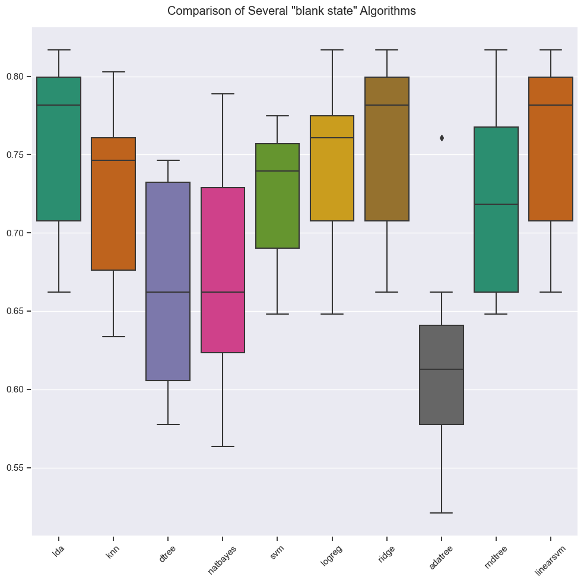

## <!--fit-->tasty bites recipe study :ramen: 
#### <!--fit-->analysis, predictions & recommendations
#

  By:  Tama Francisquez  
24.Aug.2023

<!-- _footer: ''-->
<!-- _header: ''-->

---

### business description

* Tasty Bytes: A company that puts together a full meal plan with balanced **recipes** 
  * Displays a featured recipe on the *home page*
  * Featured recipes might lead to higher traffic to the rest of the site

--- 

### problem & goal

* Currently the Product Manager handpicks recipes for the *home page* that he thinks will be popular, getting it right about 40% of the time.
   
* **Goal:** Develop an analysis and prediciton model that 
  1. Predict which recipes will lead to higher traffic to the rest of the ste.  
  2. Make those predictions correctly 80% of the time.  

---

### analysis summary

- data validation
- data exploration
- data pre processing
- model development
- model evaluation 
- business goals

---

### data validation
* The data consists of 947 rows and 8 columns

---

### numerical data exploration

--- 
### categorical data exploration

---

### categorical traffic exploration

---

### data pre-processing

1. Missing values have been imputed using the column medians.
2. Outliers have been identified using the IQR method and transformed using a robust quantile regressor.
3. A power transform to make variables normally distributed.
4. A normalization has been applied to scale variables to [0,1].

---

### model development

---

### model evaluation

| Model         | ROC-AUC | Accuracy  | F1        |
| ------------- | ------- | --------- | --------- |
| Decision Tree | 0.645   | 0.671     | 0.74      |
| Blank SVM     | 0.749   | **0.772** | **0.822** |
| Tuned LDA     | 0.747   | 0.764     | 0.812     |

---

### business recommendations

* move **SVC** model to production
* gather more data, such as: 
  * time to make
  * cost per servings
  * list of ingredients
  * date of publicaiton